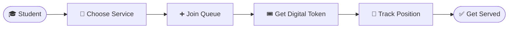
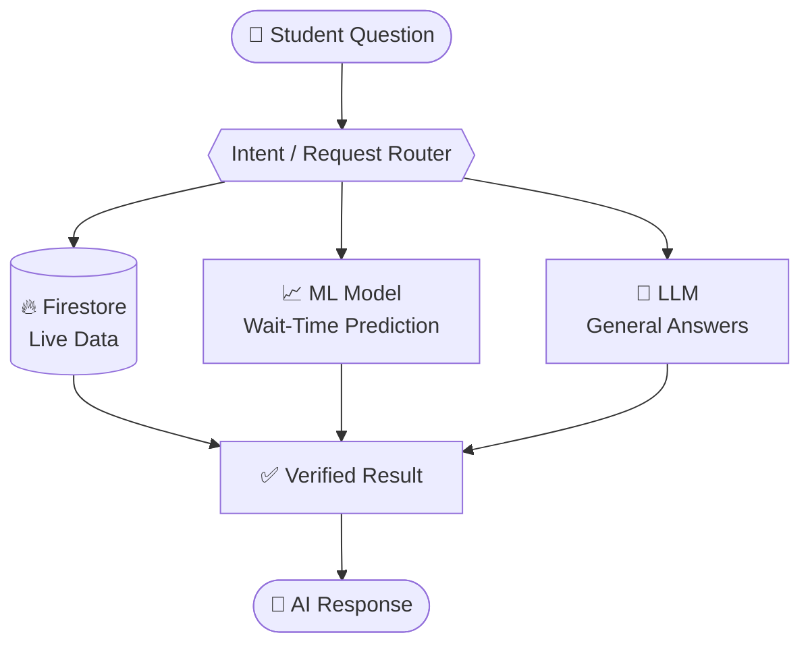
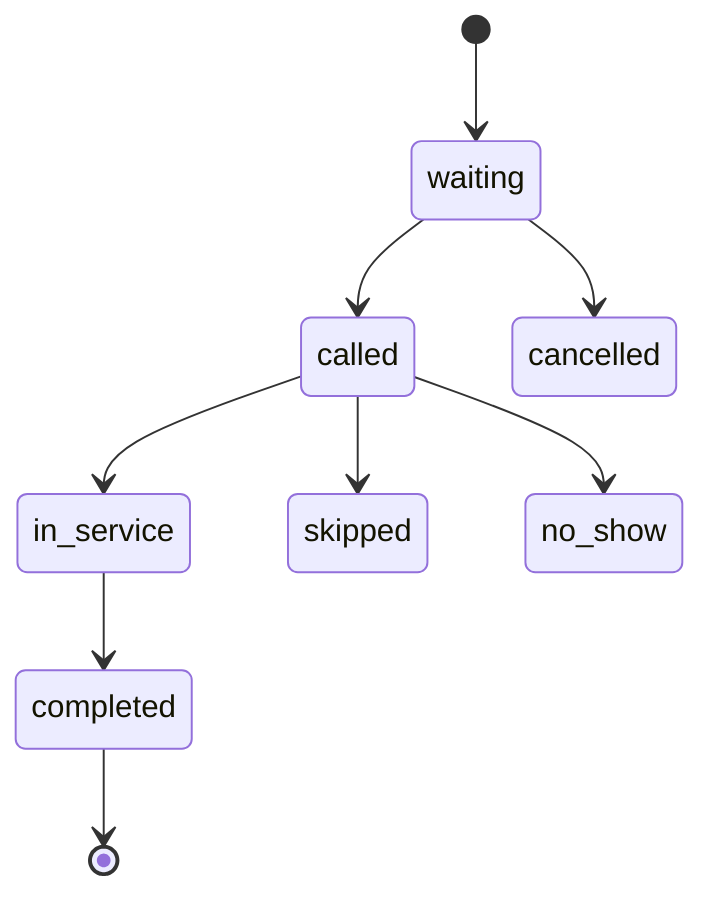
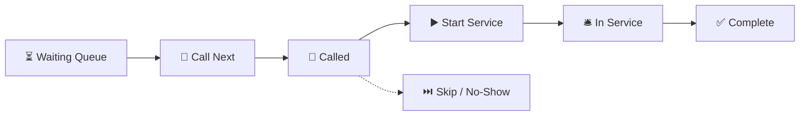
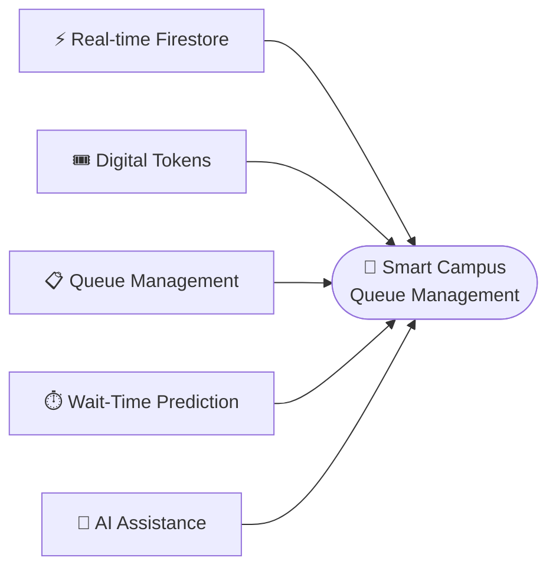

<div align="center">

# 🚦 SmartQueue

### Smart Campus Queue Manager

**Less waiting. More smart campus.**
A real-time digital queue management platform with live tokens, wait-time prediction, and an AI assistant.

<br/>

[](https://smart-queue-manage.web.app/)
[](https://react.dev/)
[](https://firebase.google.com/)
[](https://tailwindcss.com/)
[](https://fastapi.tiangolo.com/)
[](#-ai-campus-assistant)

<br/>

[🌐 **Open SmartQueue**](https://smart-queue-manage.web.app/) &nbsp;•&nbsp;
[✨ Features](#-features) &nbsp;•&nbsp;
[🤖 AI Assistant](#-ai-campus-assistant) &nbsp;•&nbsp;
[🧰 Tech Stack](#-technology-stack) &nbsp;•&nbsp;
[⚡ Quick Start](#-quick-start) &nbsp;•&nbsp;
[🔒 Security](#-security)

</div>

---

## 📑 Table of Contents

- [Overview](#-overview)
- [Features](#-features)
- [AI Campus Assistant](#-ai-campus-assistant)
- [Smart Wait-Time Prediction](#-smart-wait-time-prediction)
- [Queue Lifecycle](#-queue-lifecycle)
- [Technology Stack](#-technology-stack)
- [Authentication & Authorization](#-authentication--authorization)
- [Firestore Data Model](#️-firestore-data-model)
- [Application Routes](#-application-routes)
- [Project Structure](#-project-structure)
- [Quick Start](#-quick-start)
- [Deployment](#-firebase-deployment)
- [Real-Time Updates](#-real-time-queue-updates)
- [Security](#-security)
- [Roadmap](#-roadmap)
- [Testing Checklist](#-testing-checklist)
- [Performance](#-performance)

---

## ✨ Overview

**SmartQueue** replaces physical lines at campus services with a **real-time digital queue**.

- 🎓 **Students** join a service queue, receive a digital token, and track their position and estimated wait live.
- 👨‍💼 **Staff** manage live queues: call tokens, start and complete services, and handle skips or no-shows.
- 🛠️ **Admins** manage departments, services, staff accounts, analytics, and system settings.



---

## 🚀 Features

### 🎓 Student Portal

| | Feature | Description |
|:-:|---|---|
| 🏠 | **Dashboard** | Overview of active queue information |
| 🏢 | **Campus Services** | Browse available campus services |
| 🎟️ | **Digital Token** | Get a token without standing in line |
| 📍 | **Queue Position** | See your position and how many people are ahead |
| ⏱️ | **Estimated Wait** | Track your estimated waiting time |
| 🔄 | **Live Status** | Receive real-time queue updates |
| 🔔 | **Notifications** | Get queue-related notifications |
| 📜 | **History** | View previous queue activity |
| 👤 | **Profile** | Manage your student profile |
| 🤖 | **AI Assistant** | Ask questions about SmartQueue |

### 👨‍💼 Staff Portal

| | Feature | Description |
|:-:|---|---|
| 📊 | **Staff Dashboard** | Live overview of queue activity |
| 🔴 | **Live Queue** | Monitor active campus queues |
| 🏢 | **All Services** | View queues across every campus service |
| 🎯 | **Service Filter** | Filter the queue by service |
| 📢 | **Call Next** | Call the next waiting token |
| ⚡ | **Quick Call** | Quickly call a specific token |
| ▶️ | **Start Service** | Begin serving a customer |
| ✅ | **Complete Service** | Finish the current service |
| ⏭️ | **Skip / No-Show** | Handle skipped or absent tokens |
| 📈 | **Statistics** | View queue statistics |
| 📜 | **Queue History** | Review completed queue activity |
| 🤖 | **AI Assistant** | Staff-side SmartQueue assistance |

### 🛠️ Admin Portal

| | Feature | Description |
|:-:|---|---|
| 📊 | **Admin Dashboard** | System overview |
| 🏫 | **Departments** | Manage campus departments |
| 🏢 | **Services** | Manage campus services |
| 👥 | **Staff** | Manage staff accounts |
| 📈 | **Analytics** | View system analytics |
| ⚙️ | **Settings** | Configure system settings |

---

## 🤖 AI Campus Assistant

SmartQueue includes an **AI Campus Assistant** that answers questions using **verified SmartQueue data**, never guesses.

**💬 Example questions**

> *"What is my queue position?"* &nbsp;·&nbsp; *"How many people are ahead of me?"* &nbsp;·&nbsp; *"What is my estimated wait time?"*
> *"What is my token?"* &nbsp;·&nbsp; *"What is my current status?"* &nbsp;·&nbsp; *"Which counter will serve me?"*
> *"Which service has the shortest queue?"*

### 🧠 Architecture



> [!IMPORTANT]
> **🛡️ AI Safety Rule**
> For live SmartQueue information, the assistant must **never invent** token numbers, queue positions, people ahead, wait times, service names, counters, or queue status.
> If the required data is unavailable, the assistant clearly says the information is unavailable.

---

## 🧠 Smart Wait-Time Prediction

SmartQueue can use a **trained machine-learning model** to predict waiting time, with a simple formula as a reliable fallback.

**📐 Fallback formula**

```
Estimated Wait = (People Ahead × Average Service Time) ÷ Active Counters
```

**🔬 Possible ML features**

| Queue state | Service performance | Time context |
|---|---|---|
| People ahead | Average service time | Hour of day |
| Queue length | Average service duration | Day of week |
| Active counters | Historical waiting time | |
| Current in-service count | Completed tokens | |

> The ML model provides the prediction when available; the formula takes over when it isn't.

---

## 🔄 Queue Lifecycle



**Additional states:** `cancelled` · `skipped` · `no_show`

### 👨‍💼 Staff Workflow



Staff can also use **Skip**, **No-Show**, and **Quick Call**.

---

## 🧰 Technology Stack

| Layer | Technologies |
|---|---|
| 🎨 **Frontend** | React · Vite · Tailwind CSS · React Router · JavaScript / JSX |
| 🔥 **Backend & Database** | Firebase Authentication · Cloud Firestore · Firebase Hosting · Firestore `onSnapshot()` |
| 🤖 **AI & ML** | Python · FastAPI · `.pkl` wait-time model · LLM / API integration |

---

## 🔐 Authentication & Authorization

Supported roles: **`student`** · **`staff`** · **`admin`**

| Role | How they sign in |
|---|---|
| 🎓 **Student** | Firebase **Anonymous Authentication** for an accountless experience (when enabled) |
| 👨‍💼 **Staff / Admin** | Authenticated accounts |

The application role is stored in `users/{uid}`.


---

## 🗄️ Firestore Data Model

<details>
<summary><b>👤 users</b></summary>

```
users/{uid}
  uid · name · email · role · status
  departmentId · studentId · photoURL
  createdAt · updatedAt
```
</details>

<details>
<summary><b>🏫 departments</b></summary>

```
departments/{departmentId}
  name · description · status · activeCounters
  createdAt · updatedAt
```
</details>

<details>
<summary><b>🏢 services</b></summary>

```
services/{serviceId}
  name · description · departmentId · status
  averageServiceTime · activeCounters
  createdAt · updatedAt
```
</details>

<details>
<summary><b>🎟️ queues</b></summary>

```
queues/{serviceId}
  serviceId · prefix · currentTokenNumber · nextTokenNumber
  activeCounters · status · updatedAt
```
</details>

<details>
<summary><b>🎫 tokens</b></summary>

```
tokens/{tokenId}
  tokenNumber · tokenSequence · prefix
  userId · serviceId · departmentId
  status · position · estimatedWait · counterNumber
  createdAt · calledAt · serviceStartedAt
  completedAt · cancelledAt · updatedAt
```
</details>

<details>
<summary><b>🔔 notifications</b></summary>

```
notifications/{notificationId}
  userId · title · message · type · read · createdAt
```
</details>

<details>
<summary><b>📜 queueHistory</b></summary>

```
queueHistory/{historyId}
  tokenNumber · userId · serviceId · departmentId
  status · waitingTime · serviceTime · counterNumber
  createdAt · completedAt
```
</details>

---

## 🧭 Application Routes

| 🌐 Public | 🎓 Student | 👨‍💼 Staff | 🛠️ Admin |
|---|---|---|---|
| `/` | `/student` | `/staff` | `/admin` |
| `/login` | `/student/services` | `/staff/live-queue` | `/admin/departments` |
| `/register` | `/student/join-queue/:serviceId` | `/staff/counter` | `/admin/services` |
| `/services` | `/student/my-token` | `/staff/history` | `/admin/staff` |
| `/features` | `/student/notifications` | `/staff/profile` | `/admin/analytics` |
| `/about` | `/student/history` | `/staff/ai-assistant` | `/admin/settings` |
| | `/student/profile` | | |
| | `/student/ai-assistant` | | |

---

## 📁 Project Structure

```
Smart-Queue-Manage/
├── public/
├── src/
│   ├── components/
│   ├── pages/
│   │   ├── student/
│   │   ├── staff/
│   │   └── admin/
│   ├── services/
│   ├── context/
│   ├── firebase/
│   ├── hooks/
│   ├── utils/
│   ├── App.jsx
│   └── main.jsx
├── .env
├── firebase.json
├── firestore.rules
├── package.json
└── README.md
```

---

## ⚡ Quick Start

```bash
# 1️⃣ Clone the repository
git clone https://github.com/anshpatel2212/Smart-Queue-Manage.git
cd Smart-Queue-Manage

# 2️⃣ Install dependencies
npm install

# 3️⃣ Start the development server
npm run dev
```

### 🔥 Firebase Configuration

Set up **Firebase Authentication**, **Cloud Firestore**, and **Firebase Hosting**, then add a `.env` file:

```env
VITE_FIREBASE_API_KEY=your_api_key
VITE_FIREBASE_AUTH_DOMAIN=your_project.firebaseapp.com
VITE_FIREBASE_PROJECT_ID=your_project_id
VITE_FIREBASE_STORAGE_BUCKET=your_project.firebasestorage.app
VITE_FIREBASE_MESSAGING_SENDER_ID=your_sender_id
VITE_FIREBASE_APP_ID=your_app_id
```

> [!CAUTION]
> Never commit private service-account credentials or sensitive secrets to GitHub.

### 👻 Anonymous Student Authentication

1. Open the **Firebase Console**
2. Go to **Authentication**
3. Select **Sign-in method**
4. Enable **Anonymous**
5. Make sure the student flow uses Firebase Anonymous Authentication

> If Anonymous Authentication is disabled, Firebase may return `auth/admin-restricted-operation`.

---

## 🚢 Firebase Deployment

| Goal | Command |
|---|---|
| 🏗️ Build | `npm run build` |
| 🌐 Deploy hosting | `firebase deploy --only hosting` |
| 📜 Deploy Firestore rules | `firebase deploy --only firestore:rules` |
| 🚀 Deploy everything | `npm run build && firebase deploy --only hosting,firestore:rules` |

Firebase Hosting should serve the build output:

```json
{
  "hosting": {
    "public": "dist"
  }
}
```

---

## ⚡ Real-Time Queue Updates

SmartQueue uses Firestore `onSnapshot()` listeners so queue data updates instantly, with no manual refresh.

```jsx
const unsubscribe = onSnapshot(queueQuery, (snapshot) => {
  const updatedTokens = snapshot.docs.map((doc) => ({
    id: doc.id,
    ...doc.data(),
  }));

  setTokens(updatedTokens);
});

return () => unsubscribe();
```

---

## 🔒 Security

SmartQueue enforces authorization with **Firestore Security Rules**.

- 🔐 Users must **not** be able to change their own role
- 👨‍💼 Staff operations require the `staff` role
- 🛠️ Admin operations require the `admin` role
- 🛡️ Firestore Rules must enforce authorization
- 🚫 Frontend route guards alone are **not** sufficient
- 🔑 Private credentials must never be placed in frontend source code
- ⚡ Production token generation should use trusted backend logic or transactions

---

## 🗺️ Roadmap

- [ ] ☁️ Firebase Cloud Functions for atomic token generation
- [ ] 🔒 Transaction-based queue updates
- [ ] 🔔 Push notifications
- [ ] 📱 QR-code queue joining
- [ ] 🖥️ Counter display screens
- [ ] 📊 Advanced analytics
- [ ] 🧠 ML model monitoring and retraining
- [ ] 📝 Audit logs
- [ ] ♿ Accessibility improvements
- [ ] 📜 Pagination for history
- [ ] ⚡ Route-level code splitting

---

## 🧪 Testing Checklist

<details>
<summary><b>🔐 Authentication</b></summary>

- [ ] Student access works
- [ ] Anonymous authentication works
- [ ] Staff login works
- [ ] Admin login works
- [ ] Invalid credentials are rejected
- [ ] Inactive users are blocked
- [ ] Users cannot change their role
</details>

<details>
<summary><b>🎓 Student Queue</b></summary>

- [ ] Services load
- [ ] Student can join a queue
- [ ] Duplicate active tokens are prevented
- [ ] Token number is correct
- [ ] Queue position is correct
- [ ] People ahead is correct
- [ ] Estimated wait updates
- [ ] Token status updates in real time
</details>

<details>
<summary><b>👨‍💼 Staff Queue</b></summary>

- [ ] Live queue loads
- [ ] All-services view works
- [ ] Service filtering works
- [ ] Call Next works
- [ ] Quick Call works
- [ ] Start Service works
- [ ] Complete works
- [ ] Skip / No-Show works
- [ ] Statistics update
</details>

<details>
<summary><b>🤖 AI Assistant</b></summary>

- [ ] Current token comes from Firestore
- [ ] Current position comes from Firestore
- [ ] People ahead comes from Firestore
- [ ] Wait time uses verified data / model output
- [ ] Current status comes from Firestore
- [ ] Counter information uses actual queue data
- [ ] No fake or demo token values are returned
- [ ] Unknown data is reported as unavailable instead of guessed
</details>

---

## ⚡ Performance

If Vite warns that a JavaScript chunk is larger than 500 kB, it is a **performance warning, not a build failure**. Possible optimizations:

- Lazy-load routes and use dynamic imports
- Remove unused dependencies
- Split large components
- Reduce unnecessary Firestore reads
- Paginate history data

---

## 🎯 Project Goal



---

<div align="center">

### 🌟 SmartQueue
**Less Waiting. More Smart Campus.**

[](https://smart-queue-manage.web.app/)

Built by [**Ansh Patel**](https://github.com/anshpatel2212) &nbsp;•&nbsp; ⭐ Star the repo if you find it useful!

</div>
